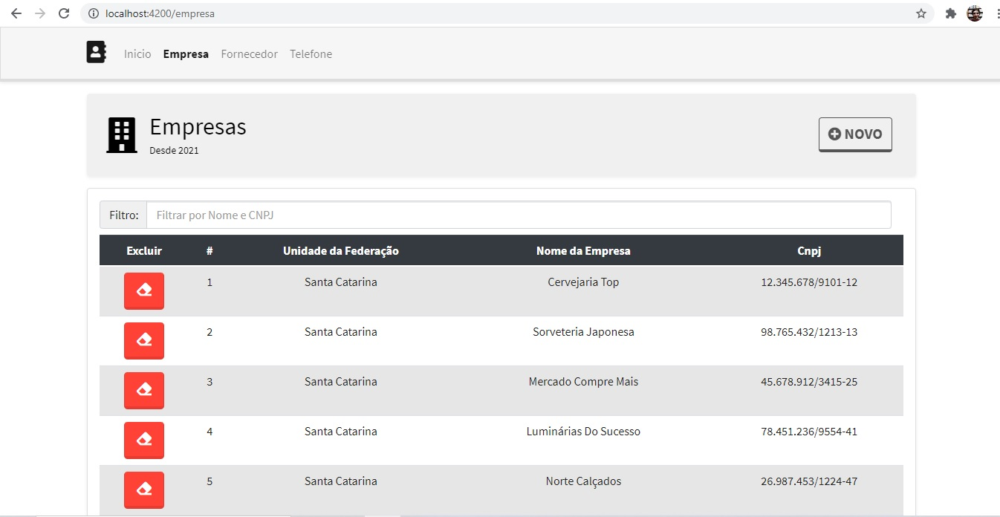
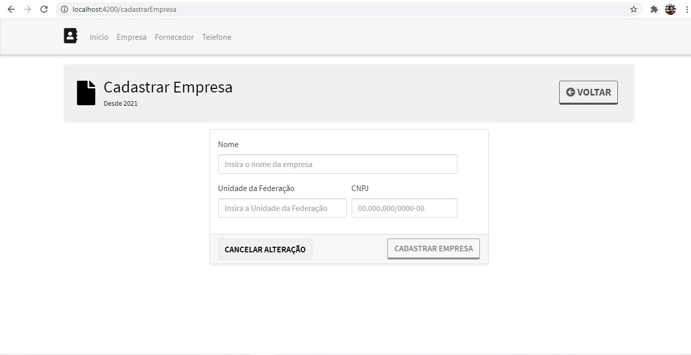
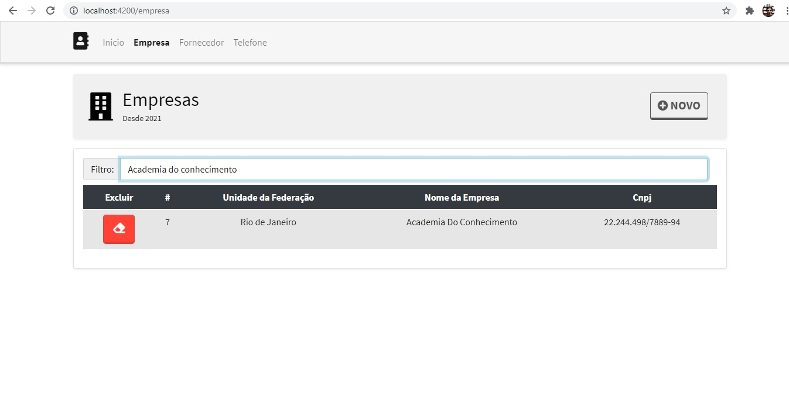
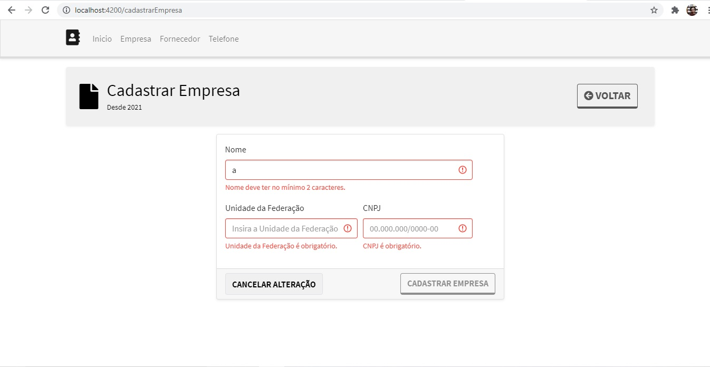
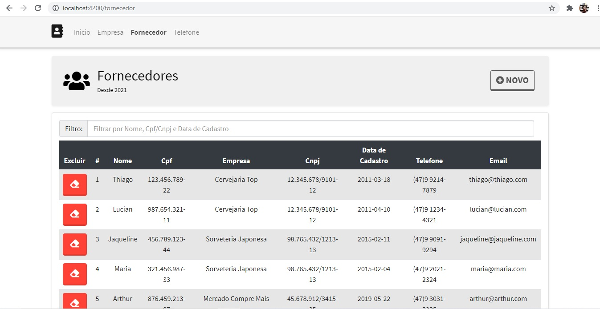
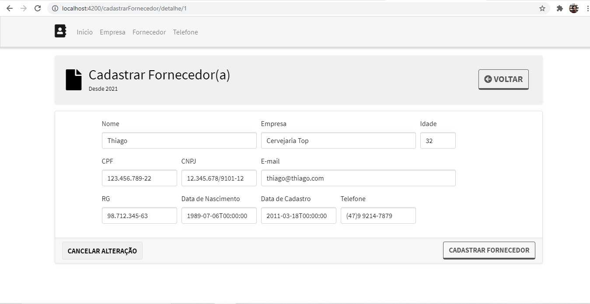

<h1>ProjetoBlu</h1>

<h2>Sobre o projeto</h2>

  Esse projeto tem o intuito de cadastrar informações de uma empresa, fornecedor, alterar, deletar e filtrar informações.
  Sim, é um pequeno crud, mas para mim o foco desse projeto não é apenas isso, é analisar como desenvolvi todo o BackEnd, 
  FrontEnd, como organizei todo o projeto. Observação, nomes cadastrados, nomes de empresas, cpfs, cnpjs já cadastrados ao executar o projeto, 
  são informações ilustrativas, ou seja, informações "inventadas" apenas para ver o funcionamento do projeto.

<h2>Ferramentas Utilizadas</h2>
<ul>
  <li>Editor VS Code.</li>
  <li>Desenvolvido na Linguagem C#.</li>
  <li>.Net Core.</li>
  <li>Banco de dados SqlServer.</li>
  <li>Postman para testar a Api.</li>
  <li>Para o FrontEnd utilizei o Angular.</li>
</ul>  

<h2>Alguns Pré-Requisitos</h2>
<ul>
  <li>Instalar VS Code.</li>
  <li>Instalar Sql Server.</li>
  <li>Instalar Node.js.</li>
  <li>Instalar Git</li>
</ul>

<h2>Como Instalar o Projeto</h2>

* Criar uma pasta na sua área de trabalho ou onde desejar no seu computador.
* Dentro da pasta que criou clicar com o botão direito do mouse e clicar em Git Bash Here.
* Agora digite: git clone https://github.com/ThiagoJDS/ProjetoBlu.git
* Agora abrir o Vs Code e abrir a Pasta ProjetoBlu.
* Entrar na pasta BackEnd dentro de appsettings.json terá que alterar a "ConexaoBaseDados" para o seu SQLServer da sua Máquina.
* Abrir o terminal do Vs Code e no terminal acessar a pasta BackEnd.
* Agora digite: dotnet ef database update
* Após isso, no terminal digite: dotnet watch run
* Aguarde compilar, vai abrir automaticamente no seu navegador o swagger, apenas minimize.
* Agora abra mais um terminal e entre na pasta FrontEnd.
* Estando na pasta FrontEnd no terminal digite: npm install
* Com isso vai instalar todas as depêndencias necessárias para rodar o projeto.
* Agora que terminou digite no terminal do FrontEnd: ng serve --open
* Com isso vai compilar o projeto e sucesso.

Uma Pequena observação, para rodar o projeto completo, é necessário que o BackEnd e FrontEnd estejam rodando.
Outra observação, caso no BackEnd seja necessário criar outra migrations, deletar a pasta que tem para criar uma nova,
após executar o comando no terminal por exemplo: dotnet ef migrations add CriacaoInicial

Após esse passo, talvez sejá necessário entrar na pasta migrations, na CriacaoInicial procurar por:

* table.ForeignKey(
* name: "FK_Fornecedors_Empresas_EmpresaId",
* column: x => x.EmpresaId,
* principalTable: "Empresas",
* principalColumn: "Id",
* onDelete: ReferentialAction.Restrict);

Na parte onDelete: ReferentialAction.Restrict, vai estar ".Cascade" alterar para ".Restrict" como nesse exemplo.
Com isso feito vamos conseguir executar o comando no terminal: dotnet ef database update

Acredito que com esse passo a passo já consiga rodar a aplicação sem problemas.

<h2>Algumas Imagens do projeto</h2>

  
  
  
  
  
  

<h2>Autor</h2>

  
Thiago Juliano da Silva

  
Contato:

  
  

